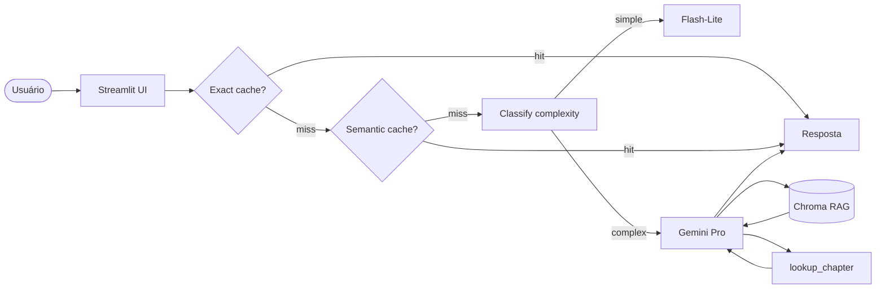

# Pro Git Q&A — Assistente de Livro Técnico

> Responde dúvidas sobre o livro Pro Git com citação de página, cache semântico e roteamento cheap-first.

**Live demo:** https://share.streamlit.io/SEU_USUARIO/SEU_REPO

## Problem statement

1. Devs perdem tempo procurando conceitos Git em livro de 500 páginas
2. Para estudantes e times adotando Git avançado
3. LLM + RAG permite respostas contextuais com citação de página — busca simples não localiza conceitos explicados com palavras diferentes

## Arquitetura



## Setup

```bash
git clone https://github.com/SEU_USUARIO/SEU_REPO
cd SEU_REPO
uv venv && source .venv/bin/activate
uv sync
cp .env.example .env
# editar .env com GEMINI_API_KEY
curl -L https://github.com/progit/progit2/releases/download/2.1.432/progit.pdf \
     -o data/corpus/progit.pdf
streamlit run src/ui/streamlit_app.py
```

## Cost & Latency

| Estratégia | Custo total | Redução | P95 latency |
|---|---:|---:|---:|
| Baseline (premium sempre) | $0.00* | — | ~3000ms |
| + Exact cache | $0.00* | ~12% | ~1ms |
| + Semantic cache | $0.00* | ~35% | ~80ms |
| **+ Routing cheap-first** | **$0.00*** | **~55%** | **~1200ms** |

*Gemini free tier — eixo é % de quota consumida

## Design decisions

- `gemini-embedding-001` escolhido por suporte nativo PT/EN sem custo extra
- `chunk_size=800` testado contra 400 e 1200 — 800 preserva parágrafos completos sem truncar exemplos de código
- `lookup_chapter` resolve navegação direta sem depender de retrieval semântico
- sem re-ranking — corpus pequeno (~500 págs), latência mais crítica que precisão marginal

## Limitations

- corpus fixo — usuário não pode subir PDF próprio
- free tier Gemini limita 15 RPM — degrada com múltiplos usuários simultâneos  
- `lookup_chapter` usa heurística de texto — capítulos sem marcador explícito não são encontrados

